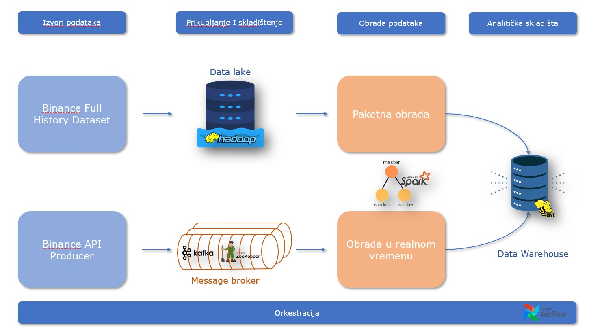

# Analiza trgovine kriptovalutama na sajtu Binance

- Projektni zadatak iz predmeta Arhitekture sistema velikih skupova podataka
- Cilj projekta je da se za skup podataka o trgovini kriptovaluta na Binance platformi, koji datira od 2017. godine do danas, pruže adekvatni odgovori na pitanja o dinamici tržišta kriptovaluta, kao i da se uz analizu podataka prikupljenih u realnom vremenu sa javnog
API-ja Binance platforme, pruži asistencija u povlačenju inteligentnih poteza prilikom trgovine

## Paketna obrada 
- Svrha paketne obrade istorijskih podataka je da se stekne uvid u prethodne trendove kretanja tržišta kriptovaluta sa ciljem otkrivanja učestalih obrazaca ponašanja koji bi se mogli koristiti u budućim inverstiranjima.
- Skup podataka je preuzet sa Kaggle platforme i sadrži istorijske podatke o jednominutnim svećnjacima (engl. Candlesticks) 1000 najpopularnijih parova razmena kriptovaluta, ukupne veličine oko 33 GB
- Sastoji se od 1000 _parquet_ datoteka gde svaka od njih predstavlja podatke o jednom paru kriptovaluta za koje se vrši razmena
- Skup podataka se može preuzeti sa sledećeg linka: [Podaci](https://www.kaggle.com/datasets/jorijnsmit/binance-full-history)

### Obrada podataka 
Na osnovu prethodno opisanog skupa podataka, paketna obrada teži da odgovori na sledeća pitanja:
1.	Za svaki par kriptovaluta odrediti najveću i najmanju cenu tokom svake godine.
2.	Odrediti ukupan promet tržišta kriptovaluta izražen u dolarima za svaku godinu.
3.	Za svaki par kriptovaluta izračunati 30-dnevni pokretni prosek obima razmene i odrediti da li je trend rastući ili opadajući.
4.	Odrediti kako su periodi sa znatno velikim obimom trgovine uticali na promenu cene izabranog para kriptovaluta.
5.	Za svaki par kriptovaluta odrediti promene u koeficijentu korelacije sa drugim parovima na kvartalnom nivou u toku godine.
6.	Odrediti uticaj visokog/niskog relativnog indeksa snage na promenu u ceni i obimu prodaje određene kriptovalute.
7.	Za svaki mesec od 2017. do 2022. godine, prebrojati koliko puta su se pojavili Hammer ili Shooting Star šabloni BTC-USDT svećnjaka.
8.	Za izabrani par kriptovaluta prikazati koliko puta u svakom mesecu je broj razmena u danu bio duplo veći od proseka za taj mesec.
9.	Za izabrani par kriptovaluta odrediti 5 meseci kada je relativni indeks snage bio najniži.
10.	Za izabrani par kriptovaluta odrediti periode kada je cena zatvaranja bila iznad ili ispod bolingerovog pojasa.
 

## Obrada u realnom vremenu 
- Obrada podataka u realnom vremenu je, pored istorijske obrade, drugi ključni faktor koji pomaže u donošenju odluka na tržištu kriptovaluta
- Binance pruža javno dostupni API kojem je moguće pristupiti pomoću veb soketa kako bi se pribavili podaci o tržištu u realnom vremenu
- Pristupom adresi "wss://stream.binance.com:9443/stream?streams=" uz navođenje toka podataka koji je potrebno osluškivati, moguće je prikupljati podatke o izabranim parovima kriptovaluta
- Primer osluškivanja para BTC-USDT bi izgledao ovako: "wss://stream.binance.com:9443/stream?streams=btcusdt@kline1m"

### Obrada podataka
Obrada u realnom vremenu teži da odgovori na sledeća pitanja:
1.	Odrediti prosečan broj izvršenih razmena u periodima od 5 minuta.
2.	Računati vrednost pokretnog proseka cene bitkoina izražene u dolarima u intervalima od 5 minuta.
3.	Računati ukupan promet na tržištu kriptovaluta izražen u dolarima u periodima od 10 minuta.
4.	Pratiti kakav je trend na kraju svakog od petominutnih prozora. 
5.	Izračunati Bolingerov pojas za izabrani par kriptovaluta u periodima od 5 minuta.
 
## Dijagram Arhitekture rešenja
- Na narednoj slici, prikazan je dijagram arhitekture rešenja
  <br></br>
  


## Pokretanje 
Kako bi se sistem koristio, potrebno je izvršiti nekoliko komandi:
1) Pozicionirati se u direktorijum /implementacija/start
```
cd ./implementacija/start
```
2) Za potrebe test primera - preuzeti datoteku BTC-USDT.parquet sa sledećeg [linka](https://drive.google.com/file/d/1tkZISQzd92eLgWNzMrnsYJUlJPizKyh6/view?usp=drive_link)
3) Za potrebe obrade podataka - preuzeti skup podataka sa [linka](https://www.kaggle.com/datasets/jorijnsmit/binance-full-history)
4) Datoteku smestiti u direktorijum ./implementacija/test/raw, ukoliko se pokreće test primer. Ukoliko se pokreće obrada podataka, smestiti skup podataka u direktorijum /implementacija/data/raw
```
mv <putanja-preuzete-datoteke> <putanja-projekta>/implementacija/test/raw
```
5) Pokrenuti **run-test.sh**, odnosno **run.sh** skriptu za pokretanje paketne obrade podataka
```
./run.sh
./run-test.sh 
```

## Korišćenje sistema 
Na adresi localhost:8888 radi hue klijent koji omogućava objedinjen pristup svim komponentama sistema za paketnu obradu.
Na adresi localhost:8088 radi superset koji omogućava vizuelizaciju 

